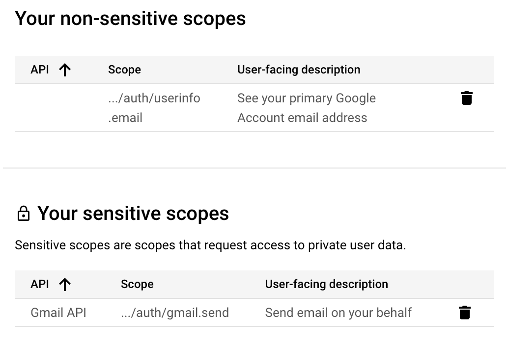

# CS3103 Group 30 Smart Mailer Program Set-up
This is a project for [Option 1] Smart Mailer Program for CS3103 Assignment. More step by step guide could be found in the video:

[](CS3103_Project_Demo.mp4)


## Contents
* [Introduction](#introduction)
* [Setting up](#setting-up-smart-mailer-program)
* [Features](#features)
    *  [Logging in (OAuth)](#logging-into-your-account-using-oauth)
    *  [Logging in (Password)](#logging-into-your-smtp-account)
    *  [Uploading files](#uploading-files)
    *  [Previewing Email](#preview-and-sending-emails)
    *  [View counts](#view-counts)
    *  [Logging Out](#logging-out)
* [Troubleshooting](#troubleshooting)
    *  [Unable to login(OAuth)](#unable-to-login-via-oauth)
    *  [Unable to login(OAuth) second time](#unable-to-login-via-oauth-after-a-second-time)
    *  [Unable to send email for google Oauth](#unable-to-send-email-for-google-oauth)


## Introduction

This smart mailer program enables mass email sending with customisable fields and view count tracking. It takes in recipient details from a CSV file, and replaces the corresponding fields in the email body. We currently support gmail and outlook accounts, using either traditional email & password combos for sending with SMTP, or OAuth login for sending with REST APIs.

## Setting up Smart Mailer Program
### Step 1:
Navigate to `cs3103-grp-30` folder (which contains `main.py`) located inside the submission ZIP.<br>
Alternatively, git clone the repository and navigate to the directory containing `main.py`:
```
git clone https://github.com/Chandan8186/cs3103-grp-30.git
cd cs3103-grp-30
```

### Step 2:
Install the required packages with pip:
```
pip install -r requirements.txt
```

### Step 3:
Launch the program with the following command:
```
# (on Windows)
python main.py

# (on MacOS or Linux)
python3 main.py
```
A successful launch on the localhost server should show the following:
```
* Running on http://127.0.0.1:5000
Press CTRL+C to quit
 * Restarting with stat
 * Debugger is active!
 * Debugger PIN: 120-854-820
127.0.0.1 - - [04/Nov/2024 18:13:00] "GET / HTTP/1.1" 302 -
127.0.0.1 - - [04/Nov/2024 18:13:00] "GET /login HTTP/1.1" 200 -
127.0.0.1 - - [04/Nov/2024 18:13:00] "GET /static/style.css HTTP/1.1" 200 -
127.0.0.1 - - [04/Nov/2024 18:13:01] "GET /favicon.ico HTTP/1.1" 404 -
```

### Step 4:
Open the application on a web browser using the following URL:

- `http://localhost:5000`, if you are planning to use Outlook OAuth login for the app, or
- `http://127.0.0.1:5000` otherwise.

Opening the web application should lead to the following page:
<br>


## Features
The smart mailer program allows you to schedule multiple batches of  emails at once, and track their send status and view counts with ease.

### Logging into your account using OAuth

Google and Outlook OAuth can be used for this web application.

Generating a client id and client secret is necessary to use OAuth (if you are hosting this application yourself). You may follow the [Google](https://developers.google.com/identity/protocols/oauth2/web-server#python) or [Outlook](https://learn.microsoft.com/en-us/partner-center/marketplace-offers/create-or-update-client-ids-and-secrets) official documentations to do so. Do remember to include the following authorized URIs:

```
(Outlook)
http://localhost:5000/login/azure/authorized

(Google)
http://127.0.0.1:5000/login/google/authorized
```

Here is an example:
<br>


Paste the client ID and secret into `main.py` as required. You may need to relaunch the web application.
<br>


### Logging into your SMTP account

Fill in the login details for your email account. Do note that some email providers such as Gmail requires users to generate and use an application password instead of their actual password. You may follow the link [here](https://www.gmass.co/blog/gmail-smtp/) to set up your app password.

**Note: Outlook has deprecated basic auth and SMTP may not work properly. Please use OAuth Authentication instead. You may refer to the following instructions for [logging into your account using OAuth](#logging-into-your-account-using-oauth).** 

### Uploading files

After successfully logging in, upload the CSV file containing recipient details and the mail body file containing the email body, and enter the department code you wish to send to.

Please ensure the files are in the appropriate format. You may view the provided sample maildata.csv and body.txt files as an example.


### Preview and Sending Emails

After selecting your files, you may click on "Preview before sending" to verify whether the emails are correct. The first email will be shown with its placeholders replaced.

Please ensure the emails are correct before sending!


### View counts

If the mail is sent successfully, the following information would be displayed on the screen, showing the send status and the view count:
<br>


When a user opens the mail, the inbuilt redirect link tracker would trigger:
<br>


The view count would increase as follows:
<br>


### Logging out

You may press the logout button at the top right corner of the webpage to logout.

## Troubleshooting

### Unable to login via Oauth

1. Double check the client ID and secret key fields and make sure you have saved the file.
2. Verify that you have specified the necessary permissions. 
    - For Outlook, ensure you have specified the following API permissions and ensured that these permissions have been granted consent as shown below:

    

    - For Google, ensure you have enabled the Gmail API and specified the following API scopes:

    

3. Make sure the [URIs](#logging-into-your-account-using-oauth) have been properly set up.
4. For Google OAuth, make sure to add your email into "Test users" if you did not set OAuth as published.

### Unable to login via OAuth after a second time

Try clearing browsing cache/cookies, or use incognito mode

### Unable to send email for Google Oauth

Try enabling IMAP access for your email account -> settings -> advanced settings -> forwarding and POP/IMAP:
<br>


Alternatively, You could also try SMTP login for Google
