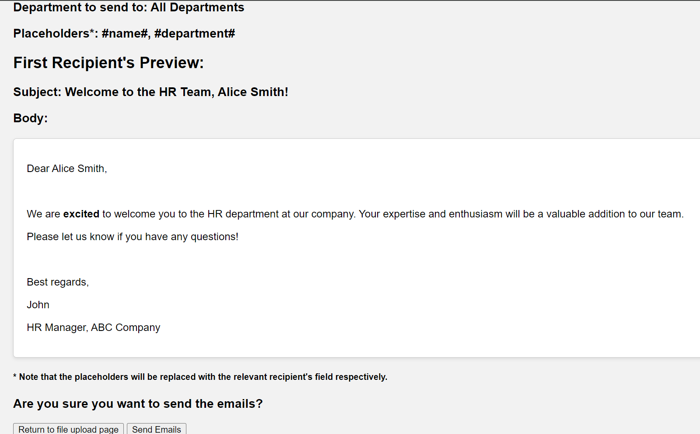

# cs3103-grp-30
This is a project for [Option 1] Smart Mailer Program for CS3103 Assignment. 

## Contents
* [Introduction](#introduction)
* [Setting up](#setting-up-smart-mailer-program)
* [Features](#features)
    *  [Logging in(OAuth)](#logging-into-your-account-oauth)
    *  [Logging in(password)](#logging-into-your-account-password)


## Introduction

This smart mailer program will send mails to a list of emails provided in a csv using outlook, gmail and other smtp services. The program reads the rows and columns of the csv and replace the variable names of the draft email provided and send out each customized emails to the users.

## Setting up Smart Mailer Program
After git cloning the program, pip install the modules in the requirements.txt:
```
git clone https://github.com/Chandan8186/cs3103-grp-30.git
#unzip and cd into the folder
pip install -r requirements.txt
```
Launch the program with the following command:
```
python main.py
```
If it is successful it should launch the web application on the localhost server:
```
* Running on http://127.0.0.1:5000
Press CTRL+C to quit
 * Restarting with stat
 * Debugger is active!
 * Debugger PIN: 120-854-820
127.0.0.1 - - [04/Nov/2024 18:13:00] "GET / HTTP/1.1" 302 -
127.0.0.1 - - [04/Nov/2024 18:13:00] "GET /login HTTP/1.1" 200 -
127.0.0.1 - - [04/Nov/2024 18:13:00] "GET /static/style.css HTTP/1.1" 200 -
127.0.0.1 - - [04/Nov/2024 18:13:01] "GET /favicon.ico HTTP/1.1" 404 -
```
Opening the web application should look something like this:


## Features
The smart mailer program allows you to send multiple resources and track them with ease on your email session

### Logging into your account OAuth

Google and Outlook OAuth are available for the web application

To get the client id and client secret for the your account, follow the [Google](https://developers.google.com/identity/protocols/oauth2/web-server#python) and [Outlook](https://learn.microsoft.com/en-us/partner-center/marketplace-offers/create-or-update-client-ids-and-secrets) official documentation and for authorized urls do as follow:


Enter the client ID and secret into the code at the follow area of main.py, you may need to launch the web application again:


Make sure to enable IMAP access for your email account:


### Logging into your account password

Enter the valid email and password for your email account. Google and outlooks supports only Oauth athentication, yahoo and hotmail allow for username and password authentication with our application

### Uploading files

After successfully logging in, upload your mail data csv file and mail body text file, followed by the department code to send to.

We included a maildata.csv and body.txt test files for you to try and undertstand the formattings


### Preview and Sending Emails

Before sending the emails, you can click on "Preview before sending" to check how the email looks like and which placeholders were replaced.

Make sure that it is exactly as you want it to be before sending the email!


### Viewing counts

### Logging out